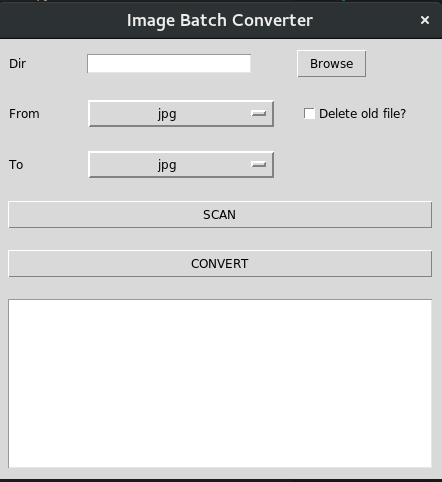

# Batch converter for images

## Introduction
An batch image converter for Ubuntu and (maybe) other Linux distros. It use ImageMagick to convert images. Now only support *jpg*, *png*, *bmp*. Have both CLI and GUI version.

## Usage
* CLI version
```bash
imageBatchConverterCLI.py -d <path to folder> -i <input extension> -o <output extension> [-r]
```

* GUI version



## Dependencies
* tkinter: if you want to use GUI.
* ImageMagick: I use bash's **convert** command to do image convertion.

## To improved
* Recursive search.
* Better interface.